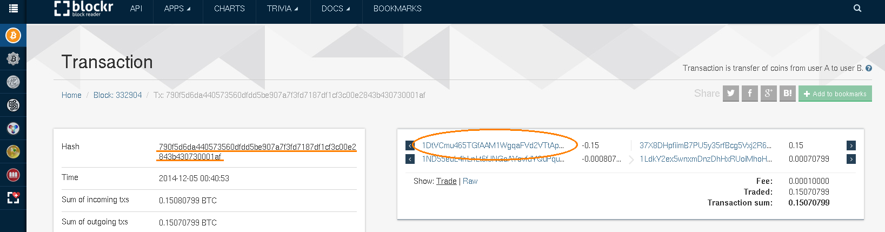
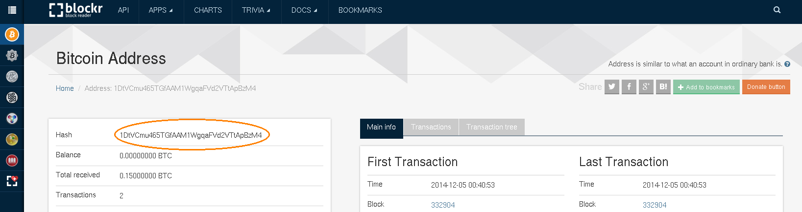
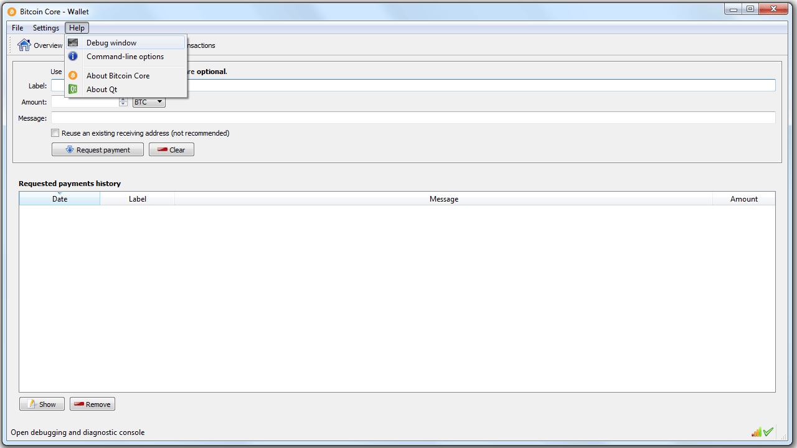
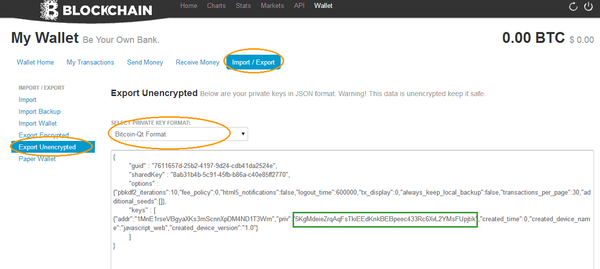
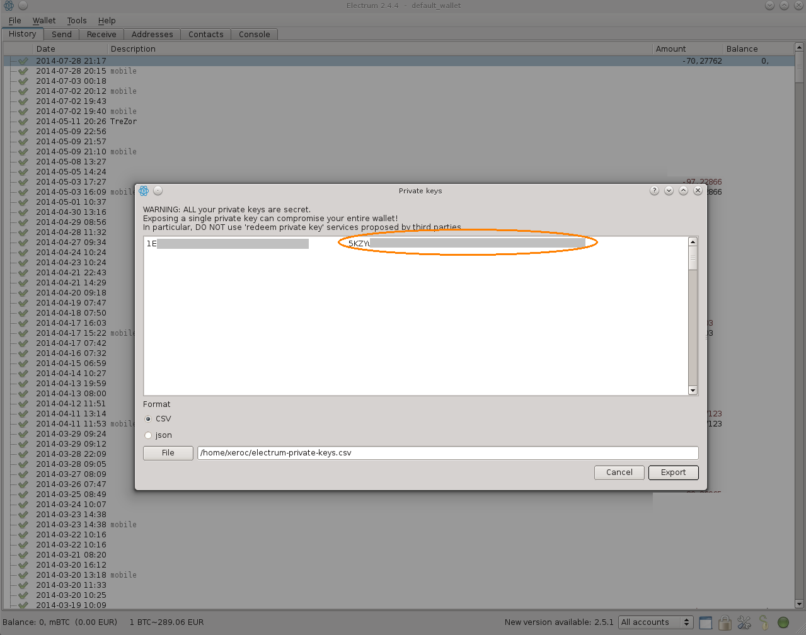
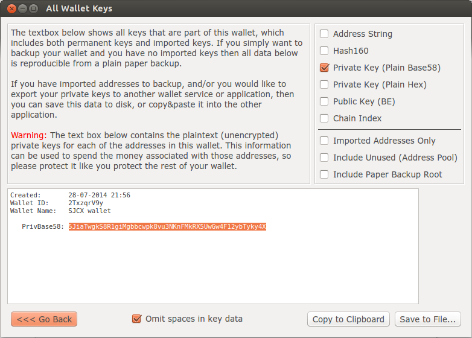

.. _muse-howto-exporting-wallet-btc:

Bitcoin Pre-Sale
************************

.. contents:: Contents
   :local:

If you have bought MUSE/NOTE token from the pre-sale paying bitcoin to the
address::

   37X8DHpfiimB7PU5y35rfBcg5Vxj2R6umL

all you need to get access to your MUSE/NOTE token is the *private key*
associated with the address that was used to send the bitcoin to that address
above. We will here assist you in how to obtain the correct private key in the
correct format from the bitcoin wallet you used.

Unless you know which Bitcoin address you have used specifically to participate
in the pre-sale, we need to identify it in order to extract the correct private
key.
If you already know the used address, you can skip this section and go
over to actually *exporting* the corresponding private key.

1) Identify your pre-sale transaction in the bitcoin client you used to
   participate in the presale
2) Copy&Paste the *transaction id*
3) Go to either the a block explorer of your choice and display the details for
   your transaction id
4) Copy and paste the **first** address used to pay for the transaction
5) Then export the private key of that address using your bitcoin client

Step-By-Step
==================

1) Search for your transaction id using http://btc.blockr.io
2) Click on the **first** address on the right hand-side

3) Copy&Paste the full address

------------

Now we are ready to export the private key(s) from your bitcoin wallet:

Exporting Private Key from Bitcoin Clients
============================================

The private keys required are in the so called *wallet import format* (wif),
they usually start with a ``5``.

Her is, how you export your private keys in the most common bitcoin
clients/wallets:

Bitcoin-QT
---------------

For Bitcoin-qt, we first need to access the *console* via the menu bar:

After that we can unlock the wallet with the passphrase and extract the private
key with::

    walletpassphrase <passphrase> 9999
    dumpprivatekey <bitcoinaddress>

Blockchain.info
========================

The advanced settings of blockchain.info offer to export an unencrypted version
of the private key:

Electrum
===============

In Electrum we need to go through the menu::

    Wallet -> Private Keys -> Export

There you can identify your private key.

Armory
===============

For armory users, the private key can be located by double-clicking your wallet
in the Armory main window, click "Backup this wallet", select "Export Key Lists"
and click the button of the same name. After having supplied your password,
you'll be presented with your private key in different encodings. You can remove
all checkboxes, except "Private Key (Plain Base58)". Check the "Omit spaces in
key data" box. Now select the key string and copy it to the clipboard.

